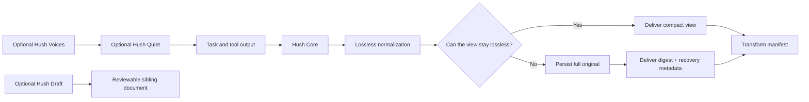

# Hush product contract and remediation plan

**Date:** 2026-07-27  
**Product version reviewed:** 0.16.4-alpha  
**Status:** SUPERSEDED — the ground-truth verdicts live in `hush-groundtruth-and-delivery-strategy-2026-07-28.md` and the executed scope contract is `hush-v1-ship-plan-2026-08-01.md`; read those instead. (Original status: product proposal, nothing approved by this document.)  
**Scope:** Hush as a product. Host-specific distribution and assistant-brand concerns are out of scope.

> [!IMPORTANT]
> This is private product-engineering documentation. It records a pessimistic
> product critique, the critique of that critique, and a proposed route to a
> trustworthy product. It is not public copy and must not be quoted into a
> README or CHANGELOG without rewriting it as current, user-visible behavior.

## Executive decision

Hush has a credible specialist product inside an over-broad product promise.
Its strongest value is reducing repeated machine-generated output during
log-heavy, multi-turn work. Its weakest claim is that a user can install it as
a universal default, always spend less, and lose nothing important.

The product should be organized around one achievable contract:

> Hush reduces repeated machine-generated output in noisy sessions, keeps the
> full original retrievable, and shows exactly what it changed. Quiet
> conversation styles are optional.

The engineering response is not to remove every ambitious feature. It is to
separate the guarantees:

- **Hush Core** owns output reduction, recovery, privacy, and measurement.
- **Hush Quiet** owns silence, progress cadence, and final-response structure.
- **Hush Voices** owns shipped and user-crafted voices.
- **Hush Draft** owns review-first compression of durable instruction files.

Only Hush Core belongs inside the cost-saving claim. Every other layer is an
optional experience with its own success criteria.

## Important review boundary

The review included the current working tree, which contains uncommitted edits
to `hush/output-styles/hush.md`, `hush/styles/README.md`, and
`hush/styles/pirate.md`. Criticism of the proposed "curious five-year-old"
register applies to that work in progress, not to the last released stock
style. Runtime, benchmark, storage, statistics, and transform findings apply to
the current implementation independently of those style edits.

## Current product surface

Hush presently combines at least five products:

1. A runtime output compressor for shell, file, search, and selected structured
   tool results.
2. A silent interaction mode backed by an output style, repeated reminders, and
   a narration meter.
3. A durable-document rewriting tool for memory and instruction files.
4. A style shelf and style generator.
5. A statistics and benchmark system.

These surfaces do not share one success metric. A teaching voice may increase
response length. A strict silent mode may reduce user control. A document
rewriter changes durable policy rather than transient output. A transform
counter can measure removed bytes but cannot prove counterfactual cost savings.

The scope problem is therefore not the number of files. It is the use of one
universal promise for features with different jobs and risk profiles.

## Assessment of the pessimistic critique

### Findings accepted as release blockers

| Finding | Severity | Product-engineering judgment |
| --- | --- | --- |
| `HUSH_DISABLE=1` does not disable every Hush behavior | Blocker | Confirmed. The silence reminder checks `HUSH_NUDGE`, while the forced style also remains active. A product-wide kill switch must be literal. |
| Structured table conversion can discard wrapper metadata | Blocker | Confirmed. A nested records array can be rendered without sibling fields such as totals or cursors. This violates the transform's lossless claim. |
| Re-read deltas can hide deleted lines | Blocker | Confirmed. Removed indexes are filtered against the new file length, so a pure tail deletion can be reported as zero changed lines. |
| "Nothing important is lost" overstates the implementation | Blocker | Correct. Hush recognizes lexical and positional signal; it does not understand semantic importance. |
| Failing output is not always kept whole | High | Correct. Failure output still has caps, and failure detection and signal preservation use different vocabularies. |
| Statistics overstate transform-level byte reduction as net savings | High | Correct. The report is useful observability, but it is not a counterfactual cost measurement and currently clamps negative net results to zero. |
| Sidecars have no explicit lifecycle | High | Correct. Files are permission-hardened but remain until operating-system cleanup. Retention, inspection, and session cleanup are missing. |
| The benchmark supports a specialist workload, not a universal default | High | Correct. The aggregate win is driven by noisy workloads, while many ordinary tasks cost more. |
| Memory compression verifies structure rather than meaning | High | Correct. The original-file guarantee reduces damage, but the verifier cannot certify semantic equivalence. |
| Style activation lacks an immutable stock source and transactional recovery | Medium | Correct. An installed active slot and its adjacent backup are too fragile to be canonical state. |

### Findings accepted with narrower wording

| Finding | Calibration |
| --- | --- |
| Condensation loses data | Hush often retains a recoverable full copy. The real defect is inconsistent recoverability and language that equates a heuristic digest with semantic preservation. |
| Sidecars are unsafe | The implementation already refuses symlinks, uses atomic writes, and applies restrictive file modes where supported. The remaining gap is lifecycle, disclosure, path policy, and sensitivity coverage. |
| Silence is harmful | Silence is valuable for some users and harmful for others. It is a preference and control tradeoff that should be independent from compression. |
| Styles are scope bloat | Styles are only harmful to the core proposition when they share its default, activation path, or benchmark claim. They can remain as an optional product surface. |
| The tests are inadequate | The 380-test suite provides strong mechanical coverage. The gap is semantic, adversarial, privacy, and product-level evaluation rather than general test quality. |
| The benchmark average is invalid | The average is valid for that equally weighted synthetic suite. It is not an expected-savings estimate for an unspecified user's workload. |
| Exit capture always corrupts execution semantics | The risk is narrower because wrapping is gated. It is still too invasive to be a transparent default and should not convert surrounding failure state without explicit opt-in. |

## Product conflicts and resolutions

| Conflict | Resolution |
| --- | --- |
| Savings versus fidelity | Guarantee recoverability instead of claiming importance detection. A lossy view is permitted only when the original is retained and addressable. |
| Silence versus control | Make interaction behavior independently selectable from output compression. |
| Zero setup versus trustworthy control | Ship one conservative Core policy. Keep advanced environment variables internal unless they represent stable product choices. |
| Local persistence versus privacy | Use session-scoped storage, explicit retention, cleanup, inspection, and path-based sensitivity policy. |
| Voice customization versus cost claims | Treat voices as optional and unmeasured until a named voice receives its own benchmark. |
| Byte reduction versus actual savings | Report observable transform activity separately from total usage and counterfactual estimates. |
| Short-task regressions versus noisy-task wins | Remove forced style and repeated reminder overhead from Core. Core should be inert when no qualifying output appears. |
| Deterministic rules versus semantic importance | Use deterministic rules to construct recoverable views; never state that those rules know what matters. |
| Fast alpha iteration versus stability | Define a stable product contract, configuration schema, recovery story, and release gates before 1.0. |

## Target architecture



### Hush Core

Core owns:

- lossless normalization;
- exact duplicate collapse;
- large-output persistence;
- conservative digest generation;
- structured recovery metadata;
- sidecar privacy and lifecycle;
- transform-level observability;
- compaction continuity for retained outputs.

Core should not:

- force a conversational persona;
- suppress progress narration;
- claim semantic importance detection;
- rewrite durable user documents;
- silently turn process failures into success;
- claim session-level cost savings from byte counts alone.

### Hush Quiet

Quiet owns:

- whether work is silent, quiet, or transparent;
- progress cadence;
- narration budget;
- which intermediate decisions deserve a message;
- final-response structure.

Suggested interaction modes:

| Mode | Behavior |
| --- | --- |
| Silent | One final response unless blocked, unsafe, or waiting on a long operation. |
| Quiet | Only blockers, costly-to-reverse decisions, and long-running milestones. |
| Transparent | Ordinary progress updates while Core still compresses machine output. |

Quiet is the recommended behavioral default if a default must be chosen. It
removes ritual narration without making a long or uncertain task opaque.

### Hush Voices

Voices own Anchor, Glyph, Pirate, Rock, Sensei, and crafted variants.

Every voice should declare:

- whether it is measured;
- whether it is expected to shorten or lengthen responses;
- whether it keeps a hard length cap;
- whether it is compatible with a strict cost target;
- whether it changes only voice or also response structure.

Voice activation must use an immutable stock source and an atomic generated
active slot. The active file must never be the only canonical copy of stock.

### Hush Draft

The memory-file compressor should be presented as a review-first drafting tool.
It owns:

- refusal of sensitive paths before reading;
- a mechanically preserved frontmatter block;
- a non-overwriting sibling destination;
- structural and lexical invariants;
- a semantic review diff;
- explicit user replacement of the original.

It must not describe a compressed draft as a verified equivalent.

## Fidelity policy and the existing "no intensity dials" constraint

Earlier Hush research records a binding preference against intensity dials.
Three user-facing compression levels would violate that principle even if they
were named Conservative, Balanced, and Aggressive.

The recommended reconciliation is:

1. Ship one Core policy.
2. Permit a lossy display transform only when the full original is retained,
   hashed, and retrievable.
3. Keep experimental aggressive transforms behind development-only gates until
   they meet the same recoverability contract.
4. Make Quiet and Voices independent capabilities, not compression intensity
   levels.

If product profiles are later desired, treat that as an explicit reversal of
the no-dials decision. Do not introduce profiles indirectly through an
ever-growing public environment-variable surface.

## Core transform contract

Every transform should produce a common result:

```text
transform name
lossless or lossy
reason applied
original byte count
displayed byte count
original content hash
displayed content hash
full-output location, when lossy
retention expiry, when persisted
fields or line ranges preserved
fields or line ranges omitted
```

Product invariants:

1. A lossy transform without a retrievable full original is rejected.
2. A structured transform preserves every field or does not run.
3. A transform that is not smaller is rejected.
4. A range read requested by the user passes verbatim.
5. A disabled Hush produces no rewritten input, output, instruction, or state.
6. A missing sidecar is reported as missing; rerunning is an option, never a
   claim of equivalent regeneration.
7. A failure remains a failure to the surrounding execution layer unless the
   user explicitly selected an invasive compatibility mode.
8. Statistics may report a negative outcome.

## Feature remediation specifications

### Product-wide disable

Required behavior:

- Gate every hook, reminder, meter, compaction instruction, state write,
  sidecar write, and debug manifest.
- Provide a neutral active style when disabled.
- Document whether a style change takes effect immediately or on the next
  session boundary.

Release test:

- Execute every registered hook with disable enabled.
- Assert no standard output, no additional context, no updated input or output,
  and no file creation.

### Structured results

Immediate fix:

- Reject table conversion when an enclosing object contains any sibling field
  outside the candidate records array.

Later option:

- Add a schema-aware renderer that prints wrapper metadata verbatim above a
  records table and proves every input value has one output representation.

Release tests:

- Totals, pagination cursors, warnings, status fields, empty arrays, missing
  values, embedded tabs, and embedded newlines.
- Round-trip inventory proving every scalar input value appears in the output.

### Re-read deltas

Immediate fix:

- Replace new-index-only rendering with a real line diff that represents
  additions, removals, and replacements.
- Reject ambiguous or larger-than-source deltas.
- Pass a pure deletion as deleted lines or a full view, never "zero changed."

Release tests:

- Tail deletion, head deletion, middle deletion, insertion, replacement,
  duplicate lines, line movement, truncation to empty, and newline-only change.

### Failures and exit capture

Immediate fix:

- Unify failure classification and signal preservation vocabulary.
- Stop claiming the inline failure view is complete.
- Persist the full failure output when a digest is lossy.
- Include command, exact exit code, signal census, representative detail, and
  recovery metadata.

Product direction:

- Do not wrap commands by default.
- Prefer native failure-event rewriting if a safe capability becomes
  available.
- If wrapping remains, label it an invasive compatibility option and test
  stdout, stderr, traps, explicit `exit`, strict shell modes, pure shell
  built-ins, and background execution.

### Template collapse

Classify the transform as lossy.

A recoverable digest should retain:

- first example;
- last example;
- number of collapsed lines;
- positions or fields that varied;
- safe numeric ranges when mechanically provable;
- full-output recovery metadata.

The current exemplar-plus-count form is acceptable only behind an experimental
gate or under the Core recoverability contract.

### Search result compression

Required changes:

- Keep first and last matches per file rather than only an initial slice.
- Include total matches, shown indexes, and omitted count.
- Persist or point to the full result before omitting matches.
- Treat prompt-based enumeration recognition as an optimization, not a safety
  boundary.

### Sidecar lifecycle and privacy

Required changes:

- Store outputs under a session-specific directory.
- Apply restrictive directory and file permissions.
- Write a session manifest with hashes, origin, transform, and expiry.
- Clean files at session completion according to retention policy.
- Provide inspection and manual-clear commands.
- Report retained byte count in statistics.
- Deny sensitive paths before content scanning.

Secret regular expressions remain defense-in-depth. They cannot be the privacy
boundary because confidential data is broader than recognizable credentials.

Open retention decision:

- Recommended default: remove at session end.
- Alternative: retain for a short documented period to survive compaction and
  delayed follow-up.
- Any longer retention must be explicit.

### Compaction continuity

Required changes:

- Include every still-live sidecar through a manifest rather than an arbitrary
  first twenty directory entries.
- Preserve hash, path, expiry, and producing operation.
- Say a missing output may require rerunning the operation; do not say rerunning
  necessarily regenerates equivalent data.

### Narration and silence

Required changes:

- Move behavior out of Core.
- State that a meter prevents later narration; it cannot remove words already
  generated.
- Measure the instruction overhead added by every reminder.
- Prefer one concise instruction over repeated duplicate reminders when the
  behavioral result is equivalent.
- Allow progress by elapsed task time, not only the duration of one operation.

### Statistics

Rename the current report to **compression activity**.

Report separately:

- visible bytes before and after;
- lossless and lossy transform counts;
- original outputs retained;
- sidecar bytes and expiry;
- marker, digest, reminder, and correction overhead;
- total transcript usage;
- estimated token range, if a tokenizer estimate is added;
- unavailable counterfactual savings.

Remove the zero clamp. If observed transform overhead exceeds observed byte
reduction, report the negative value.

Do not label total usage as savings. A session has no counterfactual control.

### Memory-file compression

Required changes:

- Refuse to overwrite an existing sibling without confirmation.
- Extract and restore frontmatter mechanically rather than asking a model to
  preserve it.
- Verify numbers, dates, environment variables, proper nouns, modal verbs, and
  negations in addition to current structural checks.
- Produce a side-by-side semantic review.
- Flag removed or changed sentences containing `must`, `never`, `only`,
  `required`, `do not`, or equivalent constraint language.

The verifier remains advisory. Product copy should say it catches likely
omissions, not that it proves equivalence.

### Style activation

Required changes:

- Add an immutable canonical stock style.
- Generate the active forced slot from the selected source.
- Validate before replacement.
- Use atomic writes.
- Record source path, source hash, stock version, and activation time.
- Roll back all affected files if settings mutation fails.
- Provide a recovery command that does not depend on an adjacent backup.

## Public claim corrections

These are proposed directions, not approved README edits.

| Current claim shape | Defensible replacement |
| --- | --- |
| Install it, change nothing, pay less | Hush is built for noisy, multi-turn work; short sessions may see little benefit. |
| Nothing important is lost | Hush does not modify the original source, and every lossy view keeps a path to the full output. |
| The whole failing output is kept | Failures receive a larger exact digest and a retrievable full copy. |
| Stats show how much Hush saved | Stats show what Hush transformed and how much visible output changed. |
| Re-running regenerates missing data | If retained output expires, rerunning may be necessary and may produce different data. |
| Every style carries the same measured mechanics | Stock is measured; optional voices retain selected behavioral rules but have independent output and cost characteristics. |

## Benchmark and evidence plan

### Segment the result

Report separately:

- pure questions and explanations;
- ordinary code changes;
- noisy builds;
- large-log investigations;
- multi-turn incident work;
- structured-result workflows;
- large search-result workflows;
- compaction and sidecar recovery.

Do not present an equally weighted suite average as an expected user saving.

### Improve experimental design

- Randomize arms within task-and-repetition blocks.
- Increase repetitions enough to show distribution, not only a mean.
- Publish median, mean, quartiles or confidence intervals, win rate, maximum
  regression, latency, and pass rate.
- Publish sanitized per-run records or a reproducible signed aggregate.
- Keep exact configuration, task inventory, and documentation synchronized by
  tests.
- Add real-repository and adversarial-output cohorts beside synthetic fixtures.

### Expand correctness

Existing test-pass and keyword checks should be supplemented with:

- unintended-file-change checks;
- repository diff review;
- semantic answer rubrics;
- metadata-retention checks;
- adversarial signal placement;
- privacy and cleanup checks;
- recovery-path success;
- failure-path success;
- explanation completeness;
- repeated-run nondeterminism.

### Suggested product gates

- Hush Core adds no model-visible overhead when no qualifying transform occurs.
- Core costs no more than 5% above baseline at the chosen high percentile on
  non-noisy tasks.
- Core saves at least 20% median on the declared noisy-workload segment.
- Zero structured metadata-loss cases.
- Zero unrecoverable lossy transforms.
- Zero disable leaks.
- Zero retained sidecars past configured expiry.
- No universal savings claim without a representative workload model.

The exact repetition count and percentile are decisions for the benchmark
owner. The gates above define product intent, not an approved paid campaign.

## Delivery sequence

### Phase 0 — restore literal truth

1. Fix the disable contract.
2. Disable unsafe structured table conversion cases.
3. Fix deletion deltas.
4. Remove the statistics zero clamp and rename the report.
5. Correct stale benchmark documentation.
6. Replace absolute preservation and universal savings claims when the fixes
   ship.

### Phase 1 — establish the trust boundary

1. Add the common transform manifest.
2. Require recovery metadata for every lossy view.
3. Add session-scoped sidecar lifecycle.
4. Separate failure digesting from command success.
5. Add adversarial transform tests.

### Phase 2 — separate the product layers

1. Make Core independent of the forced conversational style.
2. Move silence behavior into Hush Quiet.
3. Move voice selection and crafting into Hush Voices.
4. Reframe memory compression as Hush Draft.
5. Replace mutable stock backups with immutable sources and generated active
   state.

### Phase 3 — rebuild the evidence

1. Segment benchmark workloads.
2. Randomize arms and report distributions.
3. Publish sanitized raw records.
4. Measure Core independently from Quiet and named Voices.
5. Add privacy, recovery, and semantic-retention gates.

### Phase 4 — consider automation

Only after Core is trustworthy:

- consider automatic noisy-workload activation;
- consider schema-aware structured renderers;
- consider a stable user-facing configuration file;
- consider separately benchmarked voice profiles.

Do not add more lossy transforms before Phase 1.

## Decisions still required

1. **Default interaction:** compression-only, Quiet, or Silent?
   - Recommendation: Core plus Quiet, with Silent explicit.
2. **Sidecar retention:** session end or short grace period?
   - Recommendation: session end unless compaction continuity requires a
     documented grace period.
3. **Packaging:** separate installs or one install with optional modules?
   - Recommendation: one repository may remain, but activation and claims must
     be modular.
4. **Profiles versus no dials:** should product profiles reverse the existing
   no-intensity-dials rule?
   - Recommendation: no. Use one safe Core policy and independent optional
     capabilities.
5. **Command wrapping:** remove, retain as experimental, or expose as an
   invasive compatibility option?
   - Recommendation: off by default.
6. **Benchmark release gate:** what regression percentile and repetition count
   are required for 1.0?
7. **Public positioning:** specialist noisy-workload tool or universal session
   optimizer?
   - Recommendation: specialist until workload-aware activation is proven.

## Non-goals

- Semantic ranking of arbitrary log lines with a second model call.
- Network telemetry.
- Mutating original user files.
- Blocking tool execution to enforce cost.
- A large matrix of public tuning knobs.
- Guaranteeing that a nondeterministic operation can be recreated later.
- Claiming exact dollars saved from a session without a control.

## 1.0 readiness definition

Hush is ready to leave alpha when:

1. Disable means no Hush behavior.
2. Every lossy view is recoverable until its disclosed expiry.
3. Structured transforms preserve all metadata.
4. Deletions and failures cannot be silently hidden.
5. Sidecars have a documented lifecycle.
6. Statistics distinguish observation from estimation.
7. Core, Quiet, Voices, and Draft have separate contracts.
8. Public claims match workload-segment evidence.
9. Configuration and stock-style recovery are stable across updates.
10. The benchmark suite reports uncertainty and publishes auditable run data.

## Related implementation evidence

- Runtime compression:
  [`hush/hooks/compress-tool-output.js`](../../../hush/hooks/compress-tool-output.js)
- Silence reminder:
  [`hush/hooks/silence-nudge.js`](../../../hush/hooks/silence-nudge.js)
- Narration meter:
  [`hush/hooks/narration-meter.js`](https://github.com/V-Songbird/hush/blob/19faf0b47d3e8632c16f1a449867a53cb2a1c20e/hooks/narration-meter.js)
- Exit capture:
  [`hush/hooks/preserve-exit-code.js`](../../../hush/hooks/preserve-exit-code.js)
- Sidecar compaction continuity:
  [`hush/hooks/precompact-summary.js`](../../../hush/hooks/precompact-summary.js)
- Statistics:
  [`hush/scripts/stats.js`](https://github.com/V-Songbird/hush/blob/43215df3850be782fe38115623da4d5664aecd05/scripts/stats.js)
- Memory compression:
  [`hush/skills/hush-compress/SKILL.md`](https://github.com/V-Songbird/hush/blob/29646ab323b9353b07fd8bd884fc35f2aaad8e2c/skills/hush-compress/SKILL.md)
- Style crafting:
  [`hush/skills/craft-style/SKILL.md`](../../../hush/skills/craft-style/SKILL.md)
- Benchmark harness:
  [`hush/benchmarks/`](https://github.com/V-Songbird/hush/tree/a1e32e4174c1330b0617063dd21071f10cb6f7e2/benchmarks)


Link maintenance, 2026-09-09: removed local targets now point to retained Git revisions where those files exist. These links provide historical context; their selected revisions do not establish the exact revision measured or reviewed in this document.
