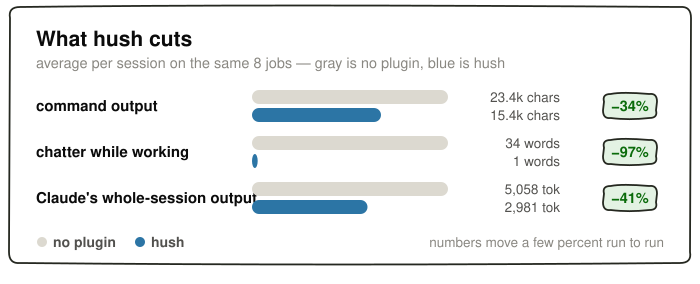

# Retained hush Claude benchmark source

Reviewed 2026-09-08. Source: hush, branch Claude, commit 13c24a9bd610a39740eb2816b54cc16b090978ed, README.md.
The source excerpt does not state its run date; the review date is not the run date.
The displayed chart uses the current flat-ink presentation of the same measurements; benchmark text and values remain unchanged. [Original chart at the recorded source commit](https://raw.githubusercontent.com/V-Songbird/hush/13c24a9bd610a39740eb2816b54cc16b090978ed/assets/bench-cuts.svg).

## Original benchmark section

Nine jobs, each in its own throwaway folder. Real sessions from start to finish — reading files,
editing code, running commands. Every job ends with a check, so a short answer that breaks the job
counts as a failure, not a win. All of it on Claude Opus 5, 36 sessions per setup, in one run.

Beside hush: [caveman](https://github.com/JuliusBrussee/caveman), which makes Claude talk like a
caveman, and the only other setup here that ever stops narrating. If you already run caveman:
hush is quieter still, and the answer comes back in plain sentences you can read at the end of
the day.

**Does it still work?**

| setup | jobs right |
| --- | --- |
| no plugin | 36 / 36 |
| caveman | 36 / 36 |
| **hush** | **36 / 36** |

**How quiet?** Every model opens with a line about what it is about to do. The number that matters
is whether it keeps talking after that.

| setup | spoke at most once before the answer | said nothing at all |
| --- | --- | --- |
| no plugin | 14 of 36 | 0 of 36 |
| caveman | 31 of 36 | 16 of 36 |
| **hush** | **36 of 36** | **30 of 36** |

**How readable?** The final message, scored on measures that have been around for decades:

| setup | words | reading ease | school grade |
| --- | --- | --- | --- |
| no plugin | 367 | 70.7 | 6.6 |
| caveman | 151 | 73.1 | 5.1 |
| **hush** | **69** | **87.7** | **2.7** |

> [!IMPORTANT]
> **Where hush doesn't win.** The short answer sometimes drops the thing you were meant to run
> next: hush ends with something runnable in 94% of sessions, every other setup here in 100%. A
> quiet job that prints little can also cost *more*, because hush's writing rules ride along on
> every step with nothing to trim against them — three of the nine jobs came out 1-10% pricier.
> And caveman is real competition on silence, not a straw man. The full picture, wins and losses
> and every job's bill, is in [the numbers](docs/BENCHMARKS.md).

*Numbers move between runs, sometimes by a lot. Run it yourself — see [benchmarks/](https://github.com/V-Songbird/foundry/tree/main/benchmarks/hush).*
