<!-- foundry:edition Codex -->

  <picture>
    <source media="(prefers-color-scheme: dark)" srcset="../../launch/assets/ember-brand-kit/hush/banner-dark.png" />
    
  </picture>
  <h1>hush</h1>
  
<strong>Less chatter. A clear answer when the work is done.</strong>

<!-- foundry:platform identity -->
**Edition: Codex.** In development; not available to install.
<!-- /foundry:platform identity -->

[Install](#install) · [Using Hush](#what-you-can-do) · [Evidence](#the-numbers) · [Limits](#good-to-know)

## What is this?

Hush reduces running commentary and long command output, so the result is easier to find. It also lets you choose how the final answer reads.

## Why you'd want it

- Follow the outcome without reading every step.
- Open the full command output when you need more detail.
- Choose a writing voice or describe your own.

## How it works

Hush works on three parts of a session: reminders discourage unnecessary narration, output controls shorten large command results, and a writing style shapes the final answer. Changing the voice does not turn off the other controls.

## Install

<!-- foundry:platform install -->
Hush for Codex is in development. This branch has no installable plugin package yet. Installation instructions will be added with a supported package.
<!-- /foundry:platform install -->

## What you can do

| When you want to… | Hush helps you… |
| --- | --- |
| Check what happened | Find the result and the next action in the final answer |
| Read a large command result | Start with shortened output and follow its full-output reference |
| Change the tone | Pick a voice or describe one of your own |

<!-- foundry:platform commands -->
No native Codex commands or skills are available yet.
<!-- /foundry:platform commands -->

## The numbers

The comparison asks whether jobs were completed correctly, how often the assistant gave at most one update, and how long its final answers were. These observations do not guarantee the same behavior in your sessions.

<!-- foundry:platform benchmarks -->
<!-- foundry:evidence {"platform":"Codex","status":"pending","reason":"No installable Codex edition or paired benchmark yet."} -->
| Model | Setup | Jobs right | At most one update | Final words |
| --- | --- | --- | --- | --- |
| Not measured | Without plugin | Not measured | Not measured | Not measured |
| Not measured | hush | Not measured | Not measured | Not measured |

No Codex performance claim is available while the package is in development.
<!-- /foundry:platform benchmarks -->

<!-- foundry:hero -->

Original Claude Code benchmark visualization. These measurements describe the recorded Claude sessions, not Codex performance. [Evidence and methodology](https://github.com/V-Songbird/foundry/tree/main/docs/hush).

Watch the recorded Claude Code demo

<!-- /foundry:hero -->

*Results can vary between runs.*

## Going deeper

<!-- foundry:platform links -->
[Project overview](https://github.com/V-Songbird/hush/tree/main)
<!-- /foundry:platform links -->

[Foundry](https://github.com/V-Songbird/foundry) holds the research, methodology and detailed evidence.

## Good to know

Correctness comes before silence. A short answer can still omit something you need, and quieter sessions do not always cost less. Check the result and next action, especially when trying a different voice.

<!-- foundry:platform compatibility -->
The shared description states the product’s purpose. It does not establish that these behaviors exist in the unfinished Codex edition.
<!-- /foundry:platform compatibility -->

## License

MIT — see [LICENSE](../../../../hush/LICENSE).
