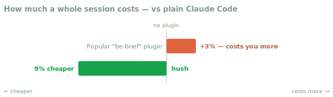
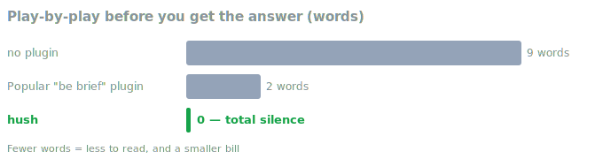

<div align="center">
  
  <h1>hush</h1>
  <p><strong>Makes Claude quieter and your sessions cheaper — less narration, less noise, one clear answer at the end.</strong></p>
</div>

---

## What is this?

You know the pattern: "Let me start by looking at…", "Now I'll check…", a 400-line wall of build output, and finally the one thing you actually wanted to know. All of it costs money — every word in a session is billed — and buries the useful part.

hush trims it at the source. Claude works quietly, tidies up noisy command output before it piles up, and gives you **one clear answer at the end**. Code, error messages, and anything you ask it to explain stay complete — hush never shortens the parts that matter.

## Why you'd want it

- **Cheaper sessions.** It shrinks the two biggest sources of bulk — noisy output and narration — so long sessions cost less.
- **Easier to read.** The answer sits at the top of one final message, not buried in a play-by-play.
- **Nothing important is lost.** Failing command output, code, diffs, and security warnings are kept whole.
- **Zero setup.** Install it and it's on. Tune it later only if you want to.

## Install

Inside Claude Code, run:

```
/plugin marketplace add V-Songbird/claude-plugins
/plugin install hush
```

The quiet style takes effect at your next session. There's nothing to invoke — hush just works in the background.

## Benchmarks

We put hush up against plain Claude Code and the popular "just be brief" plugin — same real tasks, three setups — and measured the actual bill.

<p align="center"></p>

**hush came out the cheapest of the three.** Here's the catch with prompt-based "be brief" plugins: they re-send their rules to Claude on every single turn, so they can end up costing *more* than running no plugin at all. hush doesn't work that way — it's baked into the setup once, so you simply pay less.

<p align="center"></p>

**Claude stops narrating and just answers.** No "Let me start by…", no running commentary — the thing you actually asked for sits right at the top of one clean message.

And the part that matters most: **nothing broke.** Every task still came out correct. hush trims the noise, never the substance — your code, error messages, and anything you ask it to explain stay whole.

*How we tested: we ran each setup on the same real tasks several times in a fresh, throwaway workspace and read the real cost straight from the API — no guesswork. Figures are averages on the smaller, cheaper model.*

*One honest note:* when Claude is spelunking through a big, unfamiliar codebase (lots of file reading rather than noisy command output), hush doesn't save you much. It's built to tame noisy output — that's where it earns its keep.

Curious whether this holds up? You can reproduce it yourself — see [benchmarks/](benchmarks/).

## Compress a memory file (optional)

`/hush:hush-compress <path>` shrinks a `CLAUDE.md` or notes file into a tighter form, so every future session that loads it costs a little less. It **never touches your original** — it writes a copy alongside it (`CLAUDE.md` → `CLAUDE.hush.md`) for you to review and swap in yourself.

## Under the hood

If you're curious, hush just works quietly in the background — nothing is re-sent every turn to run up your bill — and it's all there to read in the plugin's files. Pairs naturally with [razor](../razor): hush governs how Claude *talks*, razor governs what it *builds*.

## Settings

Most people never touch these, but a few environment variables tune the caps or turn parts off:

| Variable | What it does |
| --- | --- |
| `HUSH_DISABLE=1` | Turns the hooks off |
| `HUSH_CAP_PASS=60` | Lines kept from successful command output |
| `HUSH_CAP_FAIL=250` | Lines kept from failing output |
| `HUSH_NARRATION_BUDGET=120` | Words of narration before a gentle nudge |

## License

MIT — see [LICENSE](./LICENSE).
